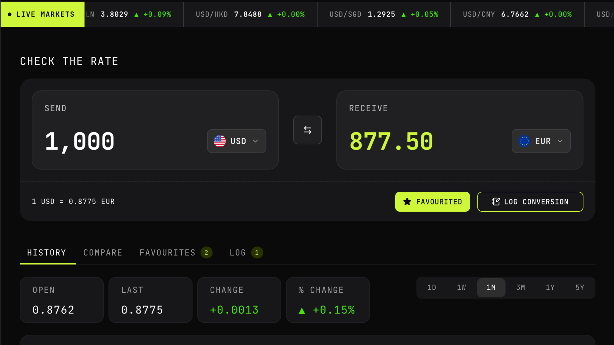

# FX Checker



A foreign exchange rate checker built with Next.js. You can convert between currencies, follow a live market ticker, review historical rate charts, compare several currencies at once, and keep favourites and conversion logs in the browser.

Rates come from the [Frankfurter API](https://www.frankfurter.app/), which publishes European Central Bank reference rates.

## Features

- Convert between supported currencies with send and receive amounts
- Swap base and quote currencies
- Live market ticker for popular pairs
- Historical charts with time ranges from 1 day to 5 years
- Compare one amount across several quote currencies
- Save favourite pairs and restore them later
- Log conversions for later reference
- Favourites and conversion logs stored locally with IndexedDB

## How it is built

The app uses the Next.js App Router. The root layout sets global fonts, styles and providers. The main page renders a client-side dashboard that owns the conversion flow and tabbed views around it.

Feature code lives under `src/features/currencies`, split into:

- **api** – fetch helpers for currencies, latest rates and historical series
- **model** – Zod schemas, types and constants
- **hooks** – React Query hooks for rates, history, favourites and logs
- **persistence** – IndexedDB repositories for favourites and conversion logs
- **components** – ticker, rate checker, charts, compare, favourites and log UI
- **utils** – amount parsing, cross rates, date ranges and ECB schedule helpers

Shared UI primitives sit in `src/components`. TanStack Query is wired through `src/lib/tanstack-query`. IndexedDB access is wrapped in `src/lib/idb`.

## Tech stack

| Area          | Libraries                                        |
| ------------- | ------------------------------------------------ |
| Framework     | Next.js 16, React 19, TypeScript                 |
| Styling       | Tailwind CSS 4, Sass modules, shadcn/ui, Base UI |
| Data fetching | TanStack Query, Zod                              |
| Charts        | Recharts                                         |
| Motion        | Framer Motion                                    |
| Local storage | IndexedDB                                        |
| Dates         | Luxon                                            |
| Flags         | country-flag-icons                               |
| Testing       | Vitest, Testing Library, Playwright, MSW         |

## Local development

1. Install dependencies

```bash
npm install
```

2. Start the development server

```bash
npm run dev
```

Open [http://localhost:3000](http://localhost:3000).

### Useful scripts

```bash
npm run check          # typecheck, lint, format check and unit tests
npm run test           # Vitest unit tests
npm run test:e2e       # Playwright end-to-end tests
npm run build          # production build
```

### Optional environment

By default the app calls `https://api.frankfurter.dev/v2`. You can override this with:

```bash
NEXT_PUBLIC_FRANKFURTER_BASE_URL=https://api.frankfurter.dev/v2
```

## Author

**Adam Richard Turner**

- Portfolio: [adamrichardturner.dev](https://adamrichardturner.dev)
- GitHub: [@adamrichardturner](https://github.com/adamrichardturner)
- LinkedIn: [Adam Richard Turner](https://linkedin.com/in/adamrichardturner88)
